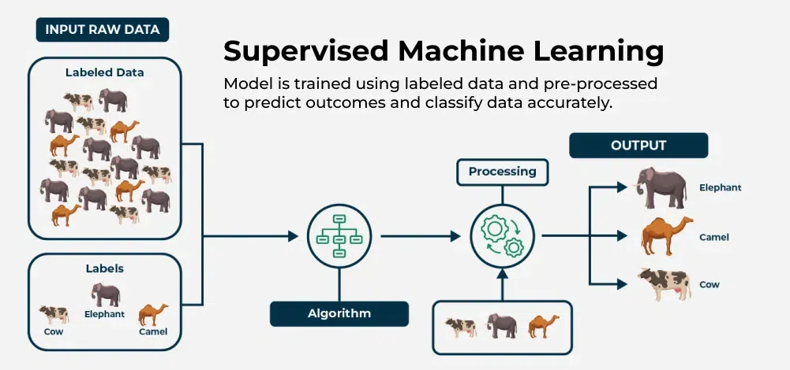
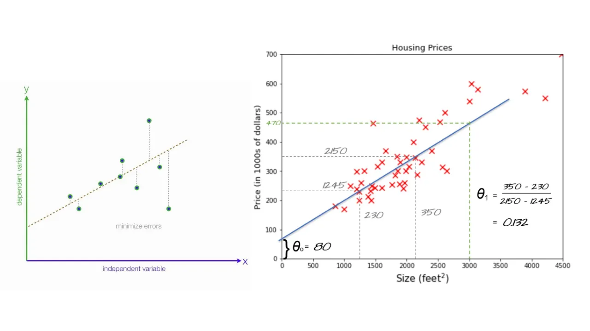
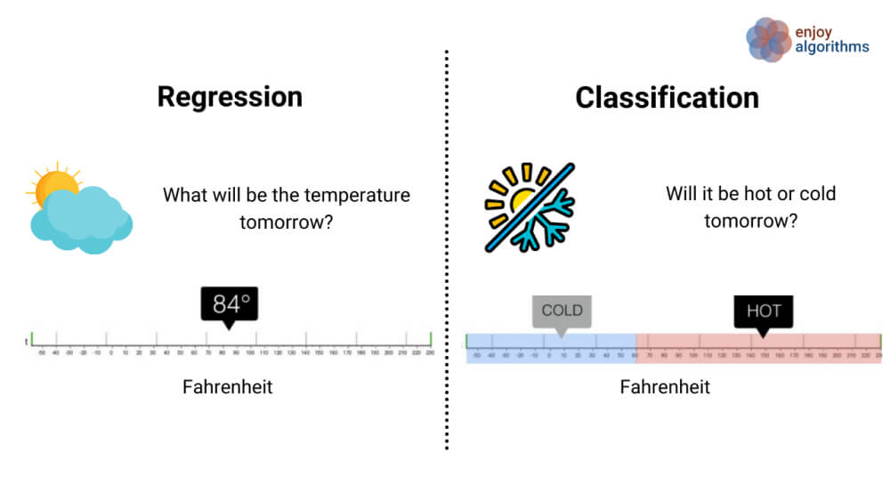

# 🧠 Supervised Learning: Overview and Examples

## 📌 What is Supervised Learning?

                    x (input) -> y (output label)
            learn from being given  **right answer**

## Definition
Supervised learning is a type of machine learning where algorithms learn **input-to-output (x → y) mappings from `labeled` examples**. The algorithm is trained on data that includes both the input (x) and the correct output (y), enabling it to predict outputs for new, unseen inputs.
> 💡 **Definition**: supervised learning algorithms learn to predict input, output or X to Y mapping.

## Key Characteristics
- Requires **labeled data** (input-output pairs).
- Goal: Predict outputs accurately for new inputs.

---

## 🧪 Real-World Applications

| Input (`x`)             | Output (`y`)         | Use Case                         |
|-------------------------|----------------------|----------------------------------|
| Email                   | Spam or Not Spam     | Spam Filtering                   |
| Audio Clip              | Text Transcript      | Speech Recognition               |
| English Sentence        | Translated Sentence  | Machine Translation              |
| Ad + User Info          | Click or Not         | Online Advertising               |
| Sensor Data + Image     | Other Car Positions  | Self-Driving Cars                |
| Product Image           | Defect or Not        | Visual Inspection in Manufacturing |

---

## 🏠 Example: Predicting Housing Prices

ref : https://medium.com/@nafizaali153/predicting-house-prices-with-linear-regression-with-java-a7784bf45f3d

- **Goal**: Predict house price based on its size (in sq. ft).
- **Approach**:
  - Train on historical data: size → price.
  - Use linear or nonlinear (curved) functions to make predictions.
- **Prediction Task**: Estimate price of a new house (e.g., 750 sq. ft).
- **Insight**: Algorithms can fit simple (line) or complex (curve) models depending on data.

---

ref : https://www.superannotate.com/blog/supervised-learning-and-other-machine-learning-tasks

## 🧩 Types of Supervised Learning

1. **Regression**
   - Predict **continuous values** (e.g., house prices).
   - Output can be any number.

   

2. **Classification**
   - Predict **discrete categories** (e.g., spam vs. not spam).
   - Will be covered in the next video.

unsup he data comes only with inputs x but not output labels y, and the algorithm has to find some structure or some pattern or something interesting in the data.