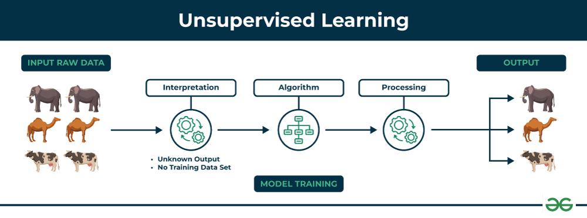
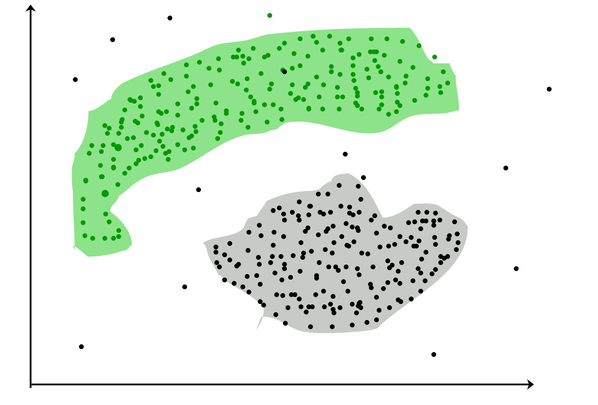
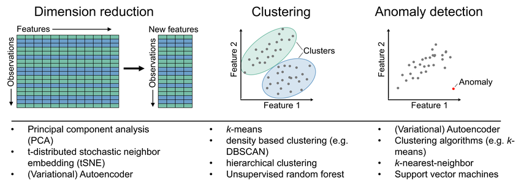
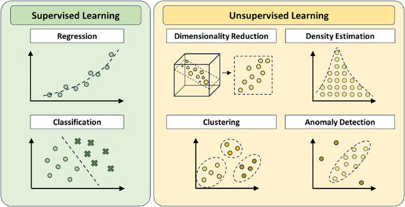

# 🧠 ==Un==supervised Learning Overview and Examples

## 📌 What is Unsupervised Learning?

## Definition
- **Unsupervised learning** works with **input data `x` only** — there are **no output labels `y`** (No "right answers") and the algorithm has to find some structure or some pattern or something interesting in the data.

 🧩 Contrast with Supervised Learning:

> In supervised learning, you're given **`x → y`**.  
> In unsupervised learning, you're only given **`x`**, and must find structure or patterns in the data.

## Key Characteristics
- Requires ** no  labeled data**.
- Goal: Discover hidden patterns, structures, or groupings in the data

## Clustering Deep Dive
| Example | Input Data | Algorithm Action | Real-World Impact |
|---------|------------|------------------|-------------------|
| **Google News** | 100K+ articles | Groups by keyword patterns (e.g., "panda") | Personalized news feeds |
| **DNA Microarrays** | Genetic activity data | Clusters people by gene expression | Personalized medicine |
| **Market Research** | Customer behavior | Identifies segments (e.g., career-focused) | Targeted marketing |
---

## 📊 Example: Tumor Dataset

- Supervised: Tumor size + age → label (benign/malignant)
- **Unsupervised**: Tumor size + age (no labels) → Group similar patients automatically

## 🩺 Example: Tumor Diagnosis Classification

- **Goal**: Classify tumors as benign or malignant based on size and patient age
- **Approach**:
  - Train on labeled medical data: tumor characteristics → diagnosis
  - Use classification algorithms to establish decision boundaries
- **Prediction Task**: Diagnose new patient's tumor (e.g., 2.3cm tumor in 45-year-old)
- **Insight**: Algorithms can create linear or complex non-linear decision boundaries to separate classes

## 📌 Types of Unsupervised Learning

### 1. Clustering
- **Goal:** Group similar data points  
- **Applications:**  
  - 📰 **Google News:** Groups related articles (e.g., "panda" + "twin" + "zoo")  
  - 🧬 **DNA Analysis:** Clusters individuals by genetic activity  
  - 🛒 **Market Segmentation:** Identifies customer groups (e.g., skill-seekers vs. career-changers)  

### 2. Anomaly Detection  
- **Goal:** Identify unusual data points  
- **Applications:**  
  - 💳 Fraud detection in financial transactions  
  - 🏥 Rare disease diagnosis  

### 3. Dimensionality Reduction  
- **Goal:** Compress data while preserving key information  
- **Applications:**  
  - 📊 Simplifying complex datasets for visualization  
  - 🖼️ Image compression  

## 🔍 Key Differences: Unsupervised Learning Techniques

| Feature               | Clustering                          | Anomaly Detection                  | Dimensionality Reduction          |
|-----------------------|-------------------------------------|------------------------------------|------------------------------------|
| **Primary Goal**      | Group similar data points           | Identify rare/unusual instances    | Reduce variables while preserving information |
| **Output**           | Data groupings/clusters             | Outlier scores/flags               | Compressed feature representation  |
| **When to Use**      | When natural groupings may exist    | When rare events are significant   | When dealing with high-dimensional data |
| **Evaluation**       | Silhouette score, Davies-Bouldin    | Precision@K, F1-score              | Reconstruction error, Variance explained |
| **Visualization**    | Cluster plots                       | Anomaly score distributions        | 2D/3D projections                  |
| **Data Sensitivity** | Sensitive to distance metrics       | Sensitive to density assumptions   | Sensitive to feature scaling       |
| **Example Use Case** | Customer segmentation               | Fraud detection                    | Image compression                  |

### 🎯 Practical Insights:
1. **Clustering** answers: "How is my data naturally grouped?"
2. **Anomaly Detection** answers: "What doesn't belong here?"
3. **Dimensionality Reduction** answers: "What's the essence of this data?"

### 🔄 Complementary Relationships:
- Often **pipeline dimensionality reduction → clustering** for better results
- Can use **clusters to establish normal behavior** for anomaly detection
- **Anomaly removal** often improves other unsupervised tasks

## Key Differences: Supervised vs. Unsupervised

| Feature | Supervised Learning | Unsupervised Learning |
|---------|---------------------|-----------------------|
| **Data** | Labeled (x + y) | Unlabeled (only x) |
| **Goal** | Predict known outputs | Discover hidden patterns |
| **Examples** | Spam filters, cancer diagnosis | News clustering, fraud detection |

---