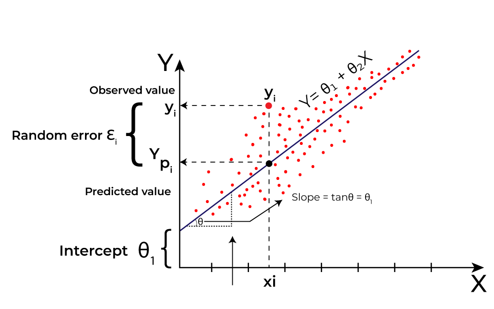

## Linear regression

---

###  Definition

**Linear regression** is a supervised learning algorithm that models the relationship between:
- One or more independent variables (features, denoted as X)
- A dependent variable (target, denoted as y) 
by fitting a linear equation to the observed data.

### Key Characteristics:
1. **Linear Relationship**: Assumes a straight-line relationship between variables
2. **Equation Form**: 
   - Simple: `y = wX + b` (one feature)
   - Multiple: `y = w₁X₁ + w₂X₂ + ... + b` (multiple features)
   where:
   - `w` = coefficients (weights)
   - `b` = y-intercept (bias term)

3. **Objective**: Minimizes the difference between predicted (ŷ) and actual values (y) using:
   - **Ordinary Least Squares (OLS)**: Minimizes sum of squared residuals

4. **Use Cases**:
   - Predicting continuous values (prices, temperatures)
   - Understanding feature importance
   - Trend analysis

### 2. Key Notation

# Housing  Dataset

## Variables
- **x**: House size (in square feet)
- **y**: Price (in thousands of dollars)

## Sample Data

| Index | Size (ft²) | Price ($1000's) |
|-------|------------|----------------|
| 1     | 2104       | 400            |
| 2     | 1416       | 232            |
| 3     | 1534       | 315            |
| 4     | 852        | 178            |
| ...   | ...        | ...            |
| 47    | 3210       | 870            |

## Example Instance
- **x** = 2104 (size in ft²)
- **y** = 400 (price in $1000's)

| Symbol | Meaning | Example |
|--------|---------|---------|
| `x` | Input feature (independent variable) | House size (2104 sq ft) |
| `y` | Output target (dependent variable) | Price ($400,000) |
| `m` | Number of training examples | 47 houses |
| `(xⁱ, yⁱ)`    | i-th training example | `(2104, 400000)` |
| `ŷ` | Predicted output | `ŷ = f(x)` |

# Supervised Learning & Linear Regression Process  

## How Supervised Learning Works  
1. **Input**: Training set with:  
   - Features (x): Input variables (e.g., house size)  
   - Targets (y): True output values (e.g., house price)  

2. **Output**: A function **`f`** (the *model*) that:  
   - Takes new input **`x`**  
   - Predicts output **`ŷ`** (estimated value)  

---

## Linear Regression Model  
- **Equation**: `f(x) = w·x + b`  
  - **`w`**: Weight (slope)  
  - **`b`**: Bias (y-intercept)  
- **Goal**: Fit a straight line to minimize prediction errors.  

### Key Terms  
- **Univariate Linear Regression**: Single input variable (e.g., house size).  
- **Non-linear vs. Linear**:  
  - Linear: Simple, foundational (straight line).  
  - Non-linear: Used for complex patterns (curves).  

---

## Next Steps  
1. **Cost Function**: Measures prediction accuracy (e.g., residual sum of squares).  
2. **Lab Exercise**: Optional Python lab to experiment with `w` and `b`.  

> 💡 **Why Linear Regression?**  
> Simple, interpretable, and the basis for advanced models.  
