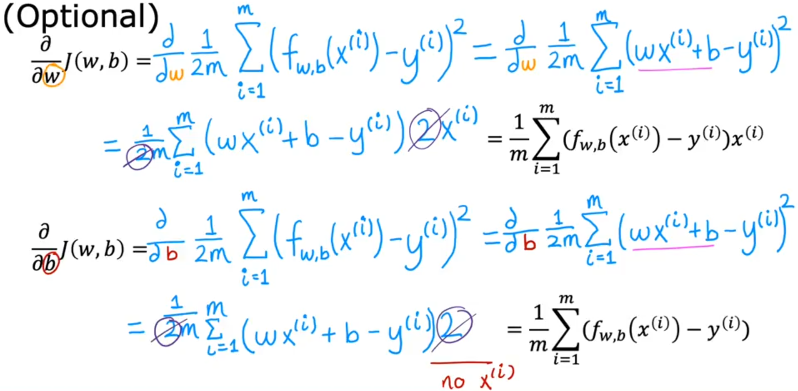
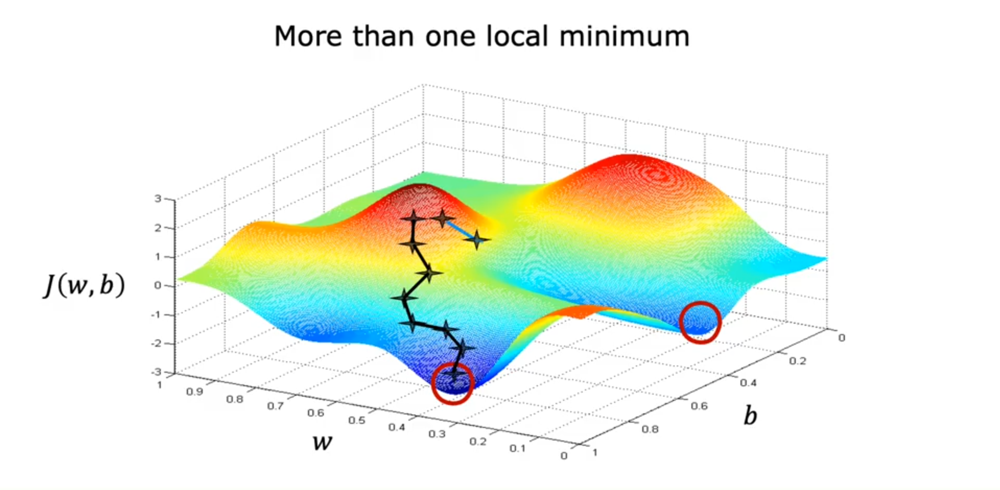
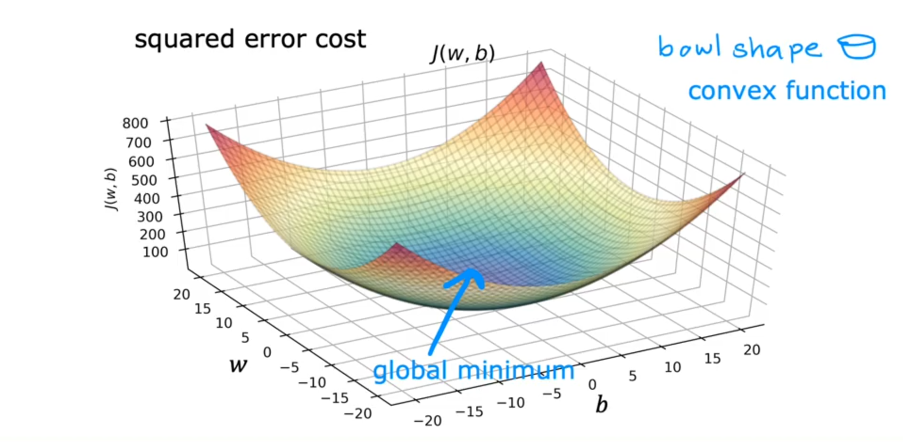
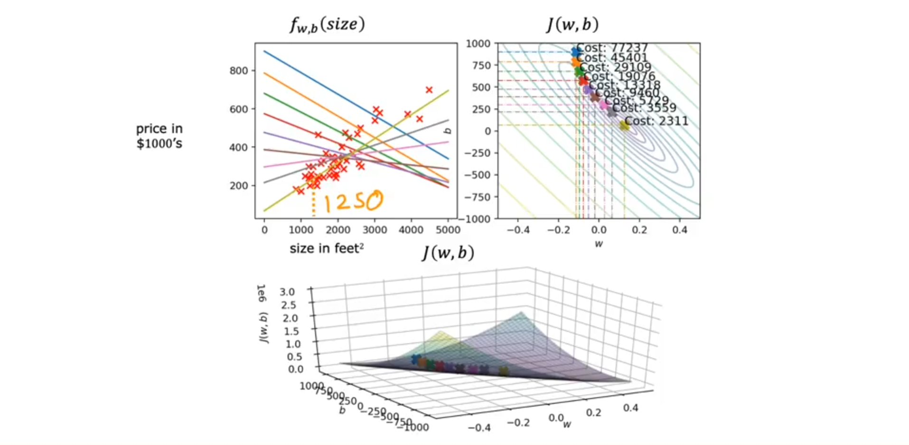
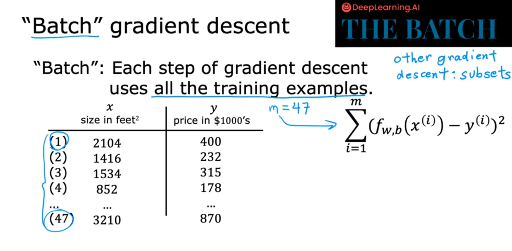

## Linear Regression

---

### Definition

  
**Reference**: [GeeksforGeeks – Linear Regression](https://www.geeksforgeeks.org/machine-learning/ml-linear-regression/)

**Linear regression** is a supervised learning algorithm that models the relationship between:
- One or more **independent variables** (features, denoted as `X`)
- A **dependent variable** (target, denoted as `y`)  
by fitting a linear equation to the observed data.

---

### How Supervised Learning Works  

1. **Input**: Training set with:  
   - **Features (`x`)**: Input variables (e.g., house size)  
   - **Targets (`y`)**: True output values (e.g., house price)  

2. **Output**: A function **`f`** (the *model*) that:  
   - Takes new input **`x`**  
   - Predicts output **`ŷ`** (estimated value)

---

### Key Notation

#### Example: Housing Dataset

| Index | Size (ft²) | Price ($1000's) |
|-------|------------|-----------------|
| 1     | 2104       | 400             |
| 2     | 1416       | 232             |
| 3     | 1534       | 315             |
| 4     | 852        | 178             |
| ...   | ...        | ...             |
| 47    | 3210       | 870             |

#### Variable Definitions

| Symbol     | Meaning                            | Example                |
|------------|------------------------------------|------------------------|
| `x`        | Input feature (independent variable) | House size (2104 sq ft) |
| `y`        | Output target (dependent variable)   | Price ($400,000)        |
| `m`        | Number of training examples          | 47 houses               |
| `(xⁱ, yⁱ)` | i-th training example                | (2104, 400000)          |
| `ŷ`        | Predicted output                     | `ŷ = f(x)`              |

---

### Key Characteristics of Linear Regression


1. **Linear Relationship**  
   - Assumes a straight-line relationship between variables

2. **Equation Form**  
   - Simple Linear Regression:  
     ```
     y = wX + b
     ```
     where:  
     - `w` = coefficient (weight)  
     - `b` = y-intercept (bias term)

3. **Objective**  
   - Minimize the difference between predicted values `ŷ` and actual values `y` using a **cost function** (e.g., MSE (Mean Squared Error))

4. **Use Cases**  
   - Predicting continuous values (e.g., prices, temperatures)  
   - Understanding feature importance  
   - Trend analysis

---


# 📉 Cost Function in Linear Regression

The **cost function** is a mathematical tool used to **quantify the error between predicted outputs and actual target values** in a regression model. It serves as a measure of how well the model's parameters fit the training data.

- **Purpose**: To evaluate the performance of the model by measuring the discrepancy between predicted and actual outcomes.
- **Objective**: Minimize the cost function in order to optimize the model parameters and improve prediction accuracy.


### ✅ Steps to Construct the Cost Function:

1. **Error**:
   \[
   \text{Error}^{(i)} = \hat{y}^{(i)} - y^{(i)}
   \]

2. **Squared Error**:
   \[
   \left( \hat{y}^{(i)} - y^{(i)} \right)^2
   \]

3. **Total Squared Error**:
   \[
   \sum_{i=1}^{m} \left( \hat{y}^{(i)} - y^{(i)} \right)^2
   \]

4. **Average Squared Error**:
   \[
   \frac{1}{m} \sum_{i=1}^{m} \left( \hat{y}^{(i)} - y^{(i)} \right)^2
   \]

5. **Final Cost Function (J)**:
   \[
   J(w, b) = \frac{1}{2m} \sum_{i=1}^{m} \left( f_{w,b}(x^{(i)}) - y^{(i)} \right)^2
   \]

> 📌 `J(w, b)` is called the **squared error cost function** and is widely used in linear regression tasks.

> 💡 **Why Divide by 2m?**  
> Dividing by 2m is a convention that makes the math easier and more elegant during model training.

---

# Gradient Descent Overview


# Introduction to Gradient Descent

- In previous lessons, we visualized the **cost function** \( J(w, b) \) and how different values of **\( w \)** and **\( b \)** affect it. (look at graph)
- A more systematic method to find the values of \( w \) and \( b \) that minimize the cost is needed → **Gradient Descent**.


#  What is Gradient Descent?

- A general optimization algorithm used across **machine learning**, including:
  - **Linear regression**
  - **Neural networks (deep learning)**
- Can minimize **any cost function**, not just those with two parameters.

# How It Works

1. **Start with initial guesses** for parameters (e.g., \( w = 0 \), \( b = 0 \)).
2. **Iteratively adjust** \( w \) and \( b \) to reduce the cost.
3. Continue updating until reaching a **minimum** value of \( J(w, b) \).

# Visualization Metaphor

- Think of the cost surface \( J(w, b) \) as a **hilly landscape**.
- Gradient descent is like **walking downhill**:
  - Look in all directions.
  - Take a **baby step** in the steepest descent direction.
  - Repeat until reaching a **valley bottom** (local minimum).

# Local Minima Insight

- Some cost functions (e.g., in neural networks) may have **multiple local minima**.
- Gradient descent may end up in **different valleys** depending on the starting point.
- In **linear regression with squared error**, the cost function is **convex**:
  - Always has **one global minimum**.

# Summary

- Gradient descent is a key algorithm in ML for **minimizing cost functions**.
- It works by taking steps in the direction of the **steepest descent**.
- Choice of initial values can affect which **local minimum** you reach.
- Sets the foundation for understanding and implementing learning algorithms.

# Gradient Descent Implementation

## Core Algorithm
- **Parameter Update Rules**:
\[
  w = w - \alpha \frac{\partial}{\partial w} J(w,b)
\]

\[
  b = b - \alpha \frac{\partial}{\partial b} J(w,b)
\]

### **Key Components**
#### **Learning Rate (α)**
- Controls step size during optimization.
- Too small (e.g., 0.001): Slow convergence.
- Too large (e.g., 1.0): Risk of overshooting minima.

> Convergence it mean **near local minima**

#### Partial Derivatives

- **∂J/∂w**: Gradient with respect to **w**  
- **∂J/∂b**: Gradient with respect to **b**

- Interpretation
	- Points in the direction of **steepest ascent**
	- **Negative gradient** → direction of **descent**

### Simultaneous Updates (✅ Correct Way)

**Update w and b simultaneously by**:
```python
temp_w = w - alpha * derivative_w
temp_b = b - alpha * derivative_b

w = temp_w
b = temp_b
```
- First calculate the updates using old values
- Then apply both updates at the same time


### 🚫 **Non-Simultaneous Updates (❌ Incorrect Way)**
In the **incorrect** method:

```python
temp_w = w - alpha * derivative_w
w = temp_w  # ← w updated too early

temp_b = b - alpha * derivative_b  # ← uses already-updated w
b = temp_b

```

**Problem**: The second update uses already-updated w, making it inconsistent. This leads to a different algorithm with different (and usually worse) behavior.

**Visualization**
```
   Start
     ↓
   Compute Gradients
     ↓
Update Parameters → Check Convergence → Stop
     ↑                             ↓
     └─────── Repeat ←────────────┘
```


# 🔍 Gradient Descent – Deeper Intuition


This lesson dives deeper into **how gradient descent works** and why it makes intuitive sense.

  
\[
  w = w - \alpha \frac{\partial}{\partial w} J(w,b)
\]


- **α (alpha)**: the **learning rate**, controls the size of the step taken.
- **∂J/∂w**: the **derivative (or partial derivative)** of the cost function, indicating the **slope** at a given point.


> - A **derivative(tells you the direction to move)** is the slope of the **tangent line at current w** 
> - The slope helps determine the **direction** and **size** of the parameter update.

---

##  Intuition from Two Scenarios

1. **Starting on the right side of the curve** (slope > 0):
 - Derivative is **positive**
 - `w = w - α * (positive)` → w **decreases**
 - You move **left**, toward the **minimum** of the cost function

2. **Starting on the left side of the curve** (slope < 0):
 - Derivative is **negative**
 - `w = w - α * (negative)` → w **increases**
 - You move **right**, toward the **minimum**

✅ In both cases, **gradient descent moves you toward the minimum (that reduce the cost function)**, reducing the cost.

---

## Learning rate


# 🧠 Understanding Learning Rate (α) in Gradient Descent


## 🔁 Gradient Descent Update Rule

\[
w := w - \alpha \cdot \frac{d}{dw}J(w)
\]

- **\( \alpha \)**: Learning rate — controls how big each update step is.
- **\( \frac{d}{dw}J(w) \)**: Derivative — the slope of the cost function at \( w \).

---

## 🚶‍♂️ Case 1: Learning Rate Too Small

- Example: \( \alpha = 0.0000001 \)
- Derivative is multiplied by a tiny number.
- **Very small update steps**.
- ✅ Gradient descent **still converges**, but **very slowly**.
- ⏳ Requires **many iterations** to reach the minimum.

---

## 🏃‍♂️ Case 2: Learning Rate Too Large

- Example: \( \alpha = 1 \) or more.
- Causes **very large jumps**.
- May **overshoot** the minimum and increase cost.
- ❌ Can **diverge** — fail to converge to a minimum.


## 🧘‍♂️ Case 3: Already at a Local Minimum

- At the minimum, the derivative is zero:
  \[
  \frac{d}{dw}J(w) = 0
  \]
- Update becomes:
  \[
  w := w - \alpha \cdot 0 = w
  \]
- ✅ No update is made — stays at the minimum.


## 📉 Automatic Step Size Reduction

- Even with fixed \( \alpha \), step size shrinks near the minimum:
  - As \( \frac{d}{dw}J(w) \to 0 \), the update step becomes small.
- This behavior **naturally slows down** convergence near the optimal point.

---

## 📊 Summary Table

| Learning Rate (α)      | Behavior                          | Outcome                         |
|------------------------|------------------------------------|----------------------------------|
| **Too Small (≪ 1)**    | Very tiny updates                  | ✅ Converges, but slowly         |
| **Just Right**         | Balanced step size                 | ✅ Efficient convergence         |
| **Too Large (≫ 1)**    | Overshooting, divergence           | ❌ May never converge            |
| **At Local Minimum**   | Derivative = 0                     | ✅ No change (as desired)        |

---


# 🔁 Gradient Descent for Linear Regression: Summary

---

## ✅ Goal

To **train a linear regression model** using **gradient descent** with the **squared error cost function**, enabling the model to fit a straight line to the training data.


## 🧮 Key Components

### 1. Linear Regression Model

$$
f(w, b, x) = w \cdot x + b
$$

### 2. Squared Error Cost Function

$$
J(w, b) = \frac{1}{2m} \sum_{i=1}^{m} \left(f(w, b, x^{(i)}) - y^{(i)}\right)^2
$$

### 3. Gradient Descent Algorithm


Update rules for minimizing the cost function:

$$
w := w - \alpha \cdot \frac{1}{m} \sum_{i=1}^{m} \left(f(w, b, x^{(i)}) - y^{(i)}\right) \cdot x^{(i)}
$$

$$
b := b - \alpha \cdot \frac{1}{m} \sum_{i=1}^{m} \left(f(w, b, x^{(i)}) - y^{(i)}\right)
$$

Where:
- \( \alpha \) is the **learning rate**
- \( m \) is the number of training examples

---

## 📐 Why These Derivatives?

- Derived using **calculus**, by taking partial derivatives of the cost function with respect to \( w \) and \( b \).
- The \( \frac{1}{2} \) in the cost function helps cancel the \( 2 \) from the derivative of the squared term, simplifying the result.

---

## 📉 Convergence and Local Minima


- The **squared error cost function** is a **convex function** (bowl-shaped).
- Convex functions have only **one global minimum** — no local minima to get stuck in.
- Therefore, gradient descent is **guaranteed to converge** to the global minimum, **if the learning rate is chosen properly**.

---


# 🧠 Comparing Convex and Non-Convex Cost Functions


---

## 🟦 Image 1: Squared Error Cost – Convex Function

### ✅ Characteristics:
- **Shape**: Smooth, **bowl-shaped** surface.
- **Function Type**: **Convex**
- **Global Minimum**: Clearly visible at the bottom of the bowl (highlighted).
- **Gradient Descent Behavior**:
  - Always converges to the **global minimum**, regardless of initialization (if learning rate is appropriate).
  - **No local minima** to get stuck in.
- **Use Case**: Common in **linear regression with squared error cost**.

---

## 🟥 Image 2: Non-Convex Function – Multiple Local Minima

### ❌ Characteristics:
- **Shape**: Complex surface with **hills and valleys**.
- **Function Type**: **Non-convex**
- **Multiple Minima**: More than one **local minimum** (circled in red).
- **Gradient Descent Behavior**:
  - May get **stuck in a local minimum**, depending on initial values of \( w \) and \( b \).
  - **Not guaranteed** to find the global minimum.
- **Use Case**: Found in **complex models** such as **neural networks** and other non-linear optimization problems.

---

## 🔍 Summary of the Difference

| Feature                        | **Convex (Image 1)**             | **Non-Convex (Image 2)**         |
|-------------------------------|----------------------------------|----------------------------------|
| Function Type                 | Convex                           | Non-convex                       |
| Number of Minima              | One global minimum               | Multiple local minima            |
| Gradient Descent Convergence | Always to global minimum         | May get stuck in local minimum   |
| Example                       | Linear Regression (Squared Loss) | Neural Networks, Complex Models  |

# 🎬 Gradient Descent in Action – Summary

---


## 🔧 Visual Setup

- **Top Left**: Plot of the linear regression model and training data.
- **Top Right**: Contour plot of the cost function \( J(w, b) \).
- **Bottom**: 3D surface plot of the same cost function.

---


## 🪜 Gradient Descent Steps

- Each **step** of gradient descent:
  - Moves the point \( (w, b) \) on the cost surface.
  - Slightly improves the line fit to the data.
- As steps continue:
  - The cost \( J(w, b) \) **decreases**.
  - Parameters follow a **trajectory** toward the **global minimum**.
  - The fitted line becomes more accurate.

---

## 🎯 Final Outcome

- Gradient descent eventually reaches the **global minimum**.
- At the global minimum:
  - The straight line is a **good fit** for the data.
  - Model can now make **predictions**.
    - Example: For a 1250 sq. ft. house, predict ≈ \$250,000.

---

## 📦 Batch Gradient Descent

- This version of gradient descent is called **batch gradient descent**.
- Why?
  - Because **every step** uses **all training examples** to compute the gradient.
- Term comes from:
  - Processing the **entire batch** (dataset) during each update.

---


