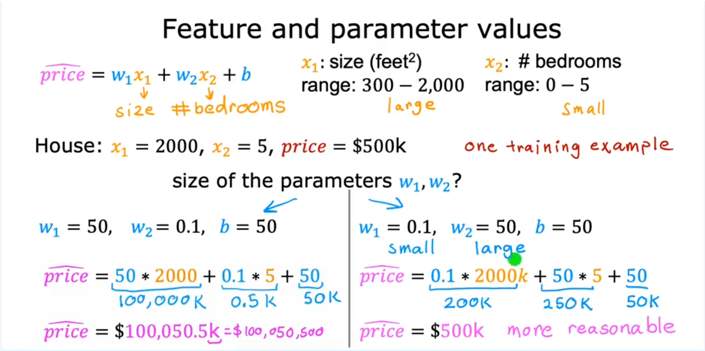
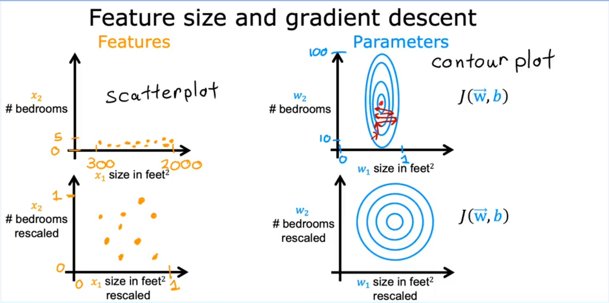
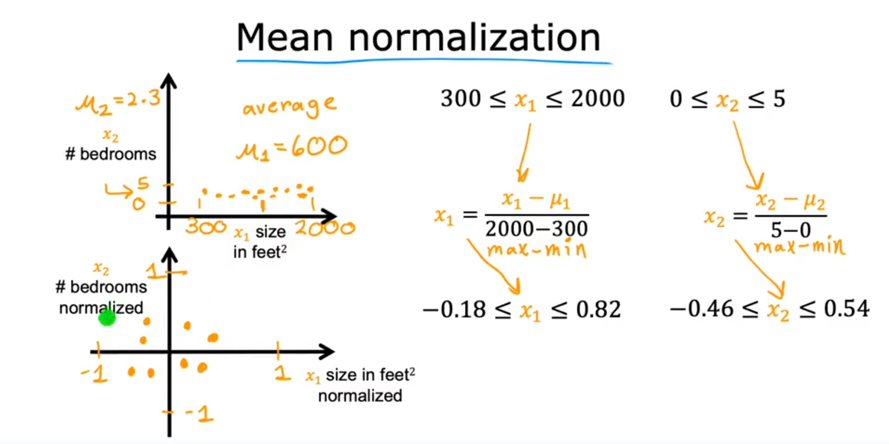
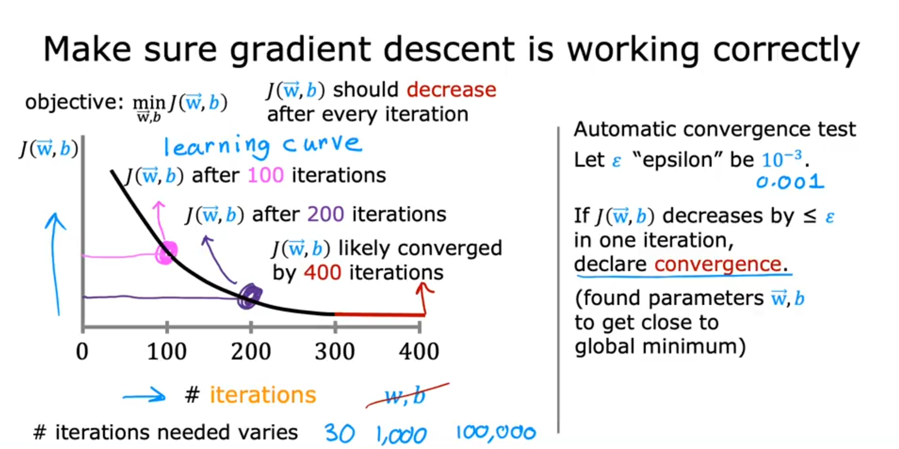
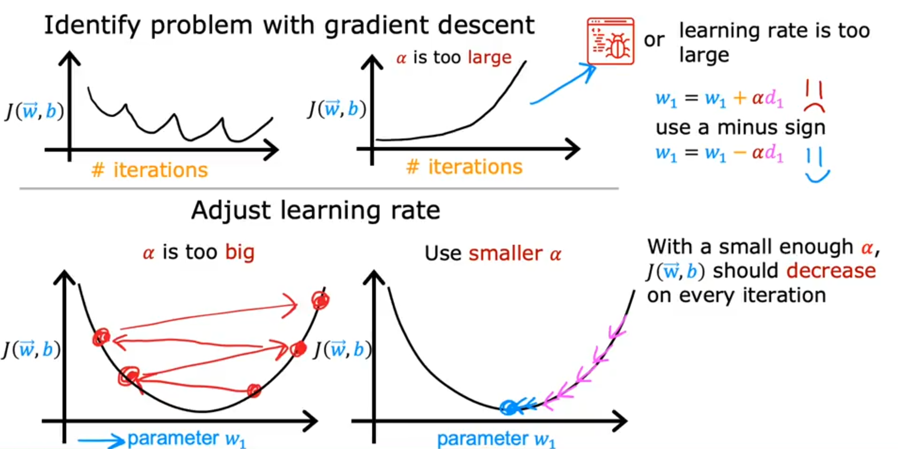
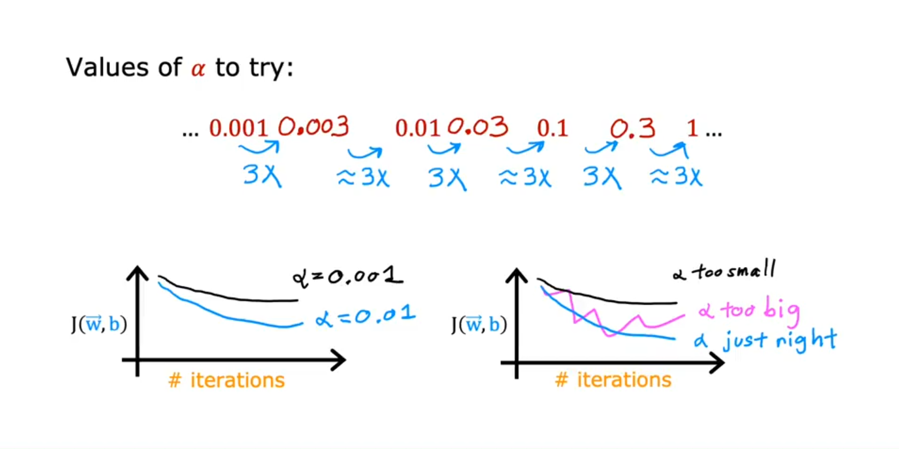

## Multiple regresion
---

# 🔍 Overview: Multiple Linear Regression

- In the earlier version of linear regression, we used only **one feature** (e.g., size of the house) to predict the output (e.g., price of the house). but for **Multiple Linear Regression** we use **multiple feature**  such as:
Size of the house (`x₁`), Number of bedrooms (`x₂`), Number of floors (`x₃`) and Age of the house (`x₄`) for predict output value


### 📚 Notation
# 📊 Multiple Features (Variables)


| Size in feet² (𝑥₁) | Number of bedrooms (𝑥₂) | Number of floors (𝑥₃) | Age of home in years (𝑥₄) | Price ($1000's) |
|:------------------:|:------------------------:|:----------------------:|:--------------------------:|:----------------:|
|       2104         |            5             |           1            |            45              |       460        |
|       1416         |            3             |           2            |            40       fด       |       232        |
|       1534         |            3             |           2            |            30              |       315        |
|        852         |            2             |           1            |            36              |       178        |
|       ...          |           ...            |          ...           |           ...              |       ...        |


- \( x_j \) = jᵗʰ feature  
- \( n = 4 \) = number of features  
- \( \vec{x}^{(i)} \) = features of the iᵗʰ training example  
- \( x_j^{(i)} \) = value of feature \( j \) in the iᵗʰ training example  

### 🟦 Example from the table:

- \( i = 2 \) → second training example  
- \( \vec{x}^{(2)} = [1416,\ 3,\ 2,\ 40] \)  
- \( x_3^{(2)} = 2 \)


---

# 🧠 Model Definition

- **Old model (1 feature)**:
  \[
  f_{w,b}(x) = wx + b
  \]

- **New model (n features)**:
  \[
  f_{w,b}(x) = w₁x₁ + w₂x₂ + \dots + wₙxₙ + b
  \]

- **Compact vector notation using dot product**:
  \[
  f_{w,b}(x) = \vec{w} \cdot \vec{x} + b
  \]


> Dot Product
>\[
>\vec{w} \cdot \vec{x} = \sum_{j=1}^{n} w_j x_j
>\]


# 🏠 Example Interpretation (House Prices)

\[
f(x) = 0.1x₁ + 4x₂ + 10x₃ - 2x₄ + 80
\]

- `0.1`: price increases by $100 per square foot
- `4`: price increases by $4,000 per bedroom
- `10`: price increases by $10,000 per floor
- `-2`: price **decreases** by $2,000 per year of age
- `80`: base price in $1,000s (i.e., $80,000)


# ⚡ Vectorization 
## Parameters and Features

\[
\vec{w} = [w_1, w_2, w_3] \quad \text{with } n = 3
\]

\[
b \text{ is a number}
\]

\[
\vec{x} = [x_1, x_2, x_3]
\]

**Note:**

- Linear algebra counts from **1**.
- Code (NumPy/Python) counts from **0**.

```python
w = np.array([1.0, 2.5, -3.3])
b = 4
x = np.array([10, 20, 30])
```

---

## Without Vectorization

\[
f_{\vec{w}, b}(\vec{x}) = \sum_{j=1}^{n} w_j x_j + b
\]


 Without Vectorization (Expanded Formula, \( n = 100{,}000 \))

\[
f_{\vec{w}, b}(\vec{x}) = w_1 x_1 + w_2 x_2 + w_3 x_3 + b
\]

```python
f = w[0] * x[0] + 
    w[1] * x[1] + 
    w[2] * x[2] + b
```

😢 Manual, repetitive, and error-prone

In Python:

```python
f = 0
for j in range(0, n):  # j = 0 to n-1
    f = f + w[j] * x[j]
f = f + b
```
## Vectorization (Efficient Way)

\[
f_{\vec{w}, b}(\vec{x}) = \vec{w} \cdot \vec{x} + b
\]

```python
f = np.dot(w, x) + b
```

😀 Clean and fast with NumPy


- **Vectorization** is a technique to make code:
  - **Shorter** (easier to read/write)
  - **Faster** (more computationally efficient)
- Uses **linear algebra operations** and libraries like **NumPy**
- Can take advantage of **parallel hardware** like **CPUs** and **GPUs**

---
## Without Vectorization

```python
for j in range(0, 16):
    f = f + w[j] * x[j]
```

At different time steps:

- \( t_0 \): \( f + w[0] \cdot x[0] \)
- \( t_1 \): \( f + w[1] \cdot x[1] \)
- ...
- \( t_{15} \): \( f + w[15] \cdot x[15] \)

⚠️ **Sequential**, not optimized


## Vectorization

```python
np.dot(w, x)
```

### Computation flow:

\[
\begin{align*}
\text{At } t_0: & \quad 
\begin{bmatrix}
w[0] & w[1] & \dots & w[15]
\end{bmatrix}
\times
\begin{bmatrix}
x[0] \\ x[1] \\ \vdots \\ x[15]
\end{bmatrix}
\quad \text{(in parallel)}
\\[10pt]
\text{At } t_1: & \quad 
w[0] \cdot x[0] + w[1] \cdot x[1] + \dots + w[15] \cdot x[15]
\end{align*}
\]

✅ **Efficient → scales to large datasets**
# 🧾 Gradient descent

## Gradient Descent

\[
\vec{w} = (w_1, w_2, \ldots, w_{16}) \quad \text{(parameters)}
\]
\[
\vec{d} = (d_1, d_2, \ldots, d_{16}) \quad \text{(derivatives)}
\]

```python
w = np.array([0.5, 1.3, ..., 3.4])
d = np.array([0.3, 0.2, ..., 0.4])
```

### Compute:

\[
w_j = w_j - 0.1 \cdot d_j \quad \text{for } j = 1 \ldots 16
\]

📝 `0.1` is the **learning rate** \( \alpha \)


### Without Vectorization

\[
\begin{align*}
w_1 &= w_1 - 0.1 d_1 \\
w_2 &= w_2 - 0.1 d_2 \\
&\vdots \\
w_{16} &= w_{16} - 0.1 d_{16}
\end{align*}
\]

```python
for j in range(0, 16):
    w[j] = w[j] - 0.1 * d[j]
```

### With Vectorization

\[
\vec{w} = \vec{w} - 0.1 \cdot \vec{d}
\]

```python
w = w - 0.1 * d
```

➡️ Performs the operation on all elements **in parallel** → ✅ **Efficient for large models**

# 🔢 Multiple Linear Regression & Vectorization – Summary

## 📌 Model Representation

- **Parameters**:  
  Instead of individual weights \( w_1, w_2, \ldots, w_n \), group them into a vector \( \vec{w} \).

- **Prediction Function**:  
  \[
  f_{\vec{w}, b}(\vec{x}) = \vec{w} \cdot \vec{x} + b
  \]

---
# Gradient descent for multiple regression


| Concept             | Previous Notation                                                                 | Vector Notation                                                                 |
|---------------------|-----------------------------------------------------------------------------------|----------------------------------------------------------------------------------|
| **Parameters**       | \( w_1, \cdots, w_n \), \( b \)                                                  | \( \vec{w} = [w_1, \cdots, w_n] \), \( b \) still a number                       |
| **Model**            | \( f_{\vec{w}, b}(\vec{x}) = w_1 x_1 + \cdots + w_n x_n + b \)                   | \( f_{\vec{w}, b}(\vec{x}) = \vec{w} \cdot \vec{x} + b \) *(dot product)*        |
| **Cost Function**    | \( J(w_1, \cdots, w_n, b) \)                                                     | \( J(\vec{w}, b) \)                                                              |
| **Gradient Descent** | repeat {<br> \( w_j = w_j - \alpha \frac{\partial}{\partial w_j} J(w_1, \cdots, w_n, b) \) <br> \( b = b - \alpha \frac{\partial}{\partial b} J(w_1, \cdots, w_n, b) \) <br>} | repeat {<br> \( w_j = w_j - \alpha \frac{\partial}{\partial w_j} J(\vec{w}, b) \) <br> \( b = b - \alpha \frac{\partial}{\partial b} J(\vec{w}, b) \) <br>} |


| Gradient Descent      | One Feature (n = 1)                                                                                          | Multiple Features (n ≥ 2)                                                                                                 |
|-----------------------|-------------------------------------------------------------------------------------------------------------|---------------------------------------------------------------------------------------------------------------------------|
| **Weight Update**     | \( w = w - \alpha \cdot \frac{1}{m} \sum_{i=1}^{m} (f_{w,b}(x^{(i)}) - y^{(i)}) \cdot x^{(i)} \)             | For each \( j = 1 \) to \( n \):<br>\( w_j = w_j - \alpha \cdot \frac{1}{m} \sum_{i=1}^{m} (f_{\vec{w},b}(\vec{x}^{(i)}) - y^{(i)}) \cdot x_j^{(i)} \) |
| **Bias Update**       | \( b = b - \alpha \cdot \frac{1}{m} \sum_{i=1}^{m} (f_{w,b}(x^{(i)}) - y^{(i)}) \)                          | \( b = b - \alpha \cdot \frac{1}{m} \sum_{i=1}^{m} (f_{\vec{w},b}(\vec{x}^{(i)}) - y^{(i)}) \)                              |
| **Update Rule**       | Simultaneously update \( w \) and \( b \)                                                                   | Simultaneously update all \( w_j \) (for \( j = 1, \dots, n \)) and \( b \)                                               |
| **Gradient Form**     | \( \frac{\partial}{\partial w} J(w, b) \)                                                                   | \( \frac{\partial}{\partial w_j} J(\vec{w}, b) \)                                                                         |


# 📌 An Alternative to Gradient Descent

## [Normal Equation](./normal-equation.md)

- Only for **linear regression**
- Solves for parameters **w** and **b** without iterations

### Disadvantages

- Doesn’t generalize to other learning algorithms  
- Slow when the number of features is large (**> 10,000**)

## 💡 What You Need to Know

- The **normal equation method** may be used in some machine learning libraries that implement linear regression.
- **Gradient descent** is the **recommended method** for finding parameters \( w, b \) in most cases.

> **Normal Equation** is a mathematical method used to find the parameters of a Linear Regression model without using iterations.
---

# Feature Scaling
This example demonstrates how the **scale of input features** affects the **model parameters** and the behavior of **gradient descent**.


---

# 🏠 Feature and Parameter Values

## 📌 Model Formula
```code
price = w₁·x₁ + w₂·x₂ + b
```
- **x₁**: size (in feet²), range: `300–2000` → large  
- **x₂**: number of bedrooms, range: `0–5` → small

## 🏡 One Training Example
x₁ = 2000, x₂ = 5, price = $500k
```code
price = w₁·2000 + w₂·5 + b
```

## 📏 Size of the Parameters `w₁`, `w₂`?

## 📊 Comparison of Parameter Scenarios (Transposed)

|                         | **Unbalanced Parameters**                           | **Reasonable Parameters**                          |
|-------------------------|-----------------------------------------------------|----------------------------------------------------|
| **Parameters**          | \( w_1 = 50 \)<br>,\( w_2 = 0.1 \)<br>,\( b = 50 \)       | \( w_1 = 0.1 \)<br>,\( w_2 = 50 \)<br>,\( b = 50 \)      |
| **Prediction Formula**  | \( 50 \cdot 2000 + 0.1 \cdot 5 + 50 \)              | \( 0.1 \cdot 2000 + 50 \cdot 5 + 50 \)             |
| **Computation Result**  | \( 100{,}000K + 0.5K + 50K = 100{,}050.5K \)        | \( 200K + 250K + 50K = 500K \)                     |
| **Outcome**             | - **Way too high** → overestimation <br>- **Poor parameter choice** due to unscaled features | ✅ Accurate – matches true <br> - **More reasonable parameter values** due to awareness of feature rangeprice                  |

---

## 🧠 Insight: Feature Ranges Affect Parameter Magnitude

- Large-range feature (like size) → smaller weight
- Small-range feature (like bedrooms) → larger weight

This mismatch can distort the cost function and affect learning.

---

## 🚀 Why Feature Scaling Matters


### 🔶 Feature Space (Input Features)

#### 🔸 Top-left (Unscaled Features)

- Features:
  - `x₁`: size in ft² (ranging from 300 to 2000)
  - `x₂`: number of bedrooms (ranging from 0 to 5)
- The two features have very different ranges.
- This causes the scatterplot to be stretched along the x-axis and compressed along the y-axis.
- As a result, gradient descent may converge slowly or inefficiently.

#### 🔸 Bottom-left (Rescaled Features)

- The same features are **rescaled** to similar ranges, typically from 0 to 1.
- Both `x₁` and `x₂` are normalized so that their magnitudes are comparable.
- The data points become more evenly distributed.
- Gradient descent becomes more stable and converges faster.

---

# 📏 Feature Scaling

Feature scaling is used to bring features with very different ranges into similar scales, which helps **gradient descent converge faster** and more reliably.

---

## 🧮 Methods of Feature Scaling

### 1. **Rescaling (Min-Max Normalization)**
- Divide each feature value by its maximum or minimum value .
- Formula:
\[
x_{\text{norm}} = \frac{x}{x_{\text{max}}}
\quad \text{or} \quad
x_{\text{norm}} = \frac{x}{x_{\text{min}}}
\]

- Example:
  - `x₁ ∈ [300, 2000] → x₁_scaled = x₁ / 2000`
  - `x₂ ∈ [0, 5] → x₂_scaled = x₂ / 5`
- Resulting scaled features fall within `[0, 1]`

---

### 2. **Mean Normalization**

- Centers features around 0 by subtracting the mean.
- Formula:
  \[
  x_{\text{norm}} = \frac{x - \mu}{\text{max} - \text{min}}
  \]

- Example:
  - `x₁ → μ = 600`, range = 300–2000  
    → `x₁_normalized ∈ [-0.18, 0.82]`
  - `x₂ → μ = 2.3`, range = 0–5  
    → `x₂_normalized ∈ [-0.46, 0.54]`

---

# 🔁 Gradient Descent Convergence

## 🧠 How to Know if Gradient Descent is Working?

Gradient descent aims to find parameters **w** and **b** that minimize the cost function **J(w, b)**. To evaluate if it’s converging properly:


## 📈 Plot the Cost Function Over Iterations


- Plot **J(w, b)** on the **vertical axis**
- Plot **number of iterations** on the **horizontal axis**
- This is called a **learning curve**

If gradient descent is working well:
- **J should decrease** with every iteration
- The curve should eventually **flatten**, indicating convergence

---

## 🚨 What If J Increases?

- Could mean:
  - 🔺 **Learning rate α is too large**
  - 🐞 **Bug** in the implementation

---


## ⏳ When Has It Converged?

- If **J stops decreasing significantly**, gradient descent has likely converged
- Example: after 300–400 iterations, curve flattens

> Convergence speed varies by application:
> - Some may converge in **30 iterations**
> - Others may need **100,000+ iterations**

---

## 🧪 Automatic Convergence Test
This section explains a simple and practical test to automatically determine if gradient descent has converged, using a small number called epsilon (ε).

### 🔍 What is ε (epsilon)?

- **Epsilon (ε)** is a small positive number used as a **threshold** for detecting convergence.
- Common value:  
  \[
  \varepsilon = 10^{-3} = 0.001
  \]


### ✅ Convergence Condition

During gradient descent, you compute the cost function \( J(w, b) \) at each iteration.

If the **change in cost** between two successive iterations is **less than or equal to ε**, we declare that gradient descent has **converged**:

\[
|J^{(i)} - J^{(i-1)}| \leq \varepsilon \quad \Rightarrow \quad \text{converged}
\]

> This means gradient descent is no longer making significant improvements and has likely reached or approached the minimum of the cost function.

### 🧠 Why This Works

- A small change in cost means the gradient is very small, and updates to parameters are minimal.
- This typically happens when gradient descent is near a **local or global minimum**.
- If updates aren’t helping much, there’s no need to keep running — we can safely stop.

### 🧷 When to Use It

- Useful in **automated training pipelines** to stop training without manual checks.
- Saves time when working with large models or datasets that require thousands of iterations.
- However, it's still good practice to **visually inspect the learning curve** to verify proper convergence and spot any unexpected behavior.


### 🔚 Summary

- Use ε (epsilon) to define how small the cost improvement must be to stop.
- If cost doesn’t decrease significantly: **stop training**.
- It’s a simple and effective method to detect **convergence**.
- Combine with **learning curve plots** for better reliability.


## 🎯 Key Takeaways
- Always monitor J vs. iterations
- If curve flattens → likely converged
- If J increases → check α or code
- Use visual inspection over automated tests for better insight

# 🚀 Choosing a Good Learning Rate (α)



Your learning algorithm's performance greatly depends on the **learning rate (α)**. Choosing it properly ensures **faster and stable convergence**. Here's how to do it:

---

## ⚠️ What Happens with a Bad Learning Rate?

### Too Small (α is too low):
- Gradient descent runs **very slowly**
- Takes a large number of iterations to converge

### Too Large (α is too high):
- **Cost function may increase** instead of decrease
- Gradient descent might **never converge**
- Can cause **oscillation** or **divergence**

---

## 📈 Diagnosing with the Cost Plot

- If the cost **goes up and down**, gradient descent is likely **not working**.
- This may be due to:
  - ❌ A bug in the code
  - 🚫 Learning rate too large

---

## 🎯 Understanding the Overshoot Problem

- Imagine cost \( J(w_1) \) vs. parameter \( w_1 \)
- A large α can cause updates to **overshoot** the minimum:
  - Jumping back and forth across the minimum
  - Failing to settle down

---

## 🛠️ Debugging Tip

- Try setting **α to a very small value**
- If cost **still doesn’t decrease every iteration**, it likely means:
  - ⚠️ There’s a **bug in the implementation**

### Example of a bug:
```python
# Wrong:
w1 = w1 + α * derivative  # This increases cost

# Correct:
w1 = w1 - α * derivative  # This decreases cost
```
## 🔍 Practical Strategy to Choose α
1. Try multiple values of α

- Start with 0.001
- Then try ~3× larger values:
- 0.003, 0.03, 0.3 etc.

2. For each value:
- Run gradient descent for a few iterations
- Plot the cost function vs. iterations

3. Pick the best α:
- Look for fast and smooth decrease in cost
- Avoid overshooting or flat (slow) curves

4. Tip:

- Try values until you find one that’s too small
- Then go up until you find one that’s too large
- Choose something slightly smaller than the largest reasonable value

## ✅ Summary

| Learning Rate α | Behavior                       |
| --------------- | ------------------------------ |
| Too Small       | Converges very slowly          |
| Too Large       | May diverge or oscillate       |
| Just Right      | Smooth, rapid decrease in cost |


# Choosing the Learning Rate (α) for Gradient Descent

## Key Principles
- **Goldilocks Principle**:
  - α too small → Slow convergence
  - α too large → Divergence (cost increases)
  - α just right → Efficient convergence

## Diagnostic Signs
| Observation | Likely Issue | Action |
|-------------|--------------|--------|
| Cost oscillates | α slightly too large | Reduce α by 3x |
| Cost consistently increases | α too large or sign error in code | Check code & reduce α |
| Cost decreases very slowly | α too small | Increase α gradually |

# Practical Workflow
1. Initialize with α=0.01
2. Monitor learning curve:
- Good: Steady exponential decay
- Bad: Oscillations/plateaus
3. Adjust using 3x rule:
- Too slow? Try 3x larger α
- Oscillating? Try α/3


# 🧾 Terminology

- **Multiple Linear Regression**: Linear regression with **multiple input features**
- **Univariate Regression**: Linear regression with a **single feature**
- Note: **"Multivariate regression"** refers to a different concept (not used here)

