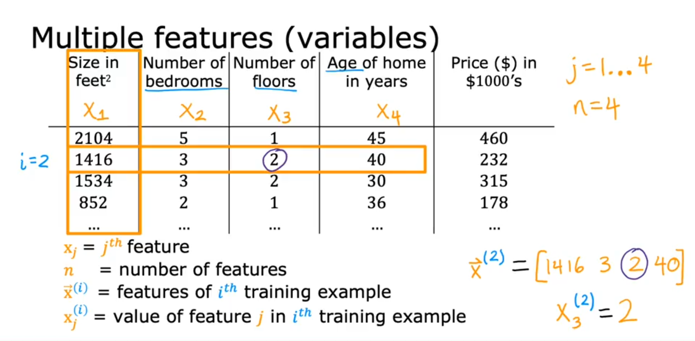
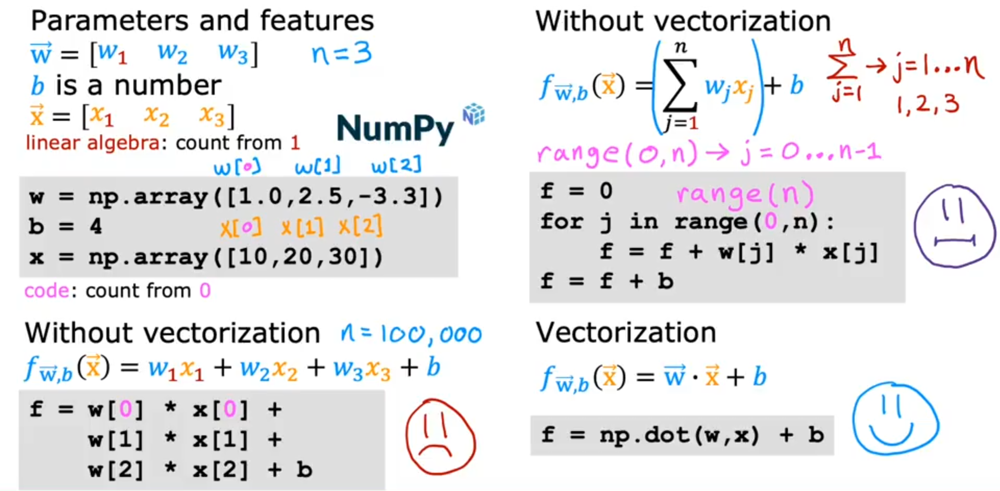
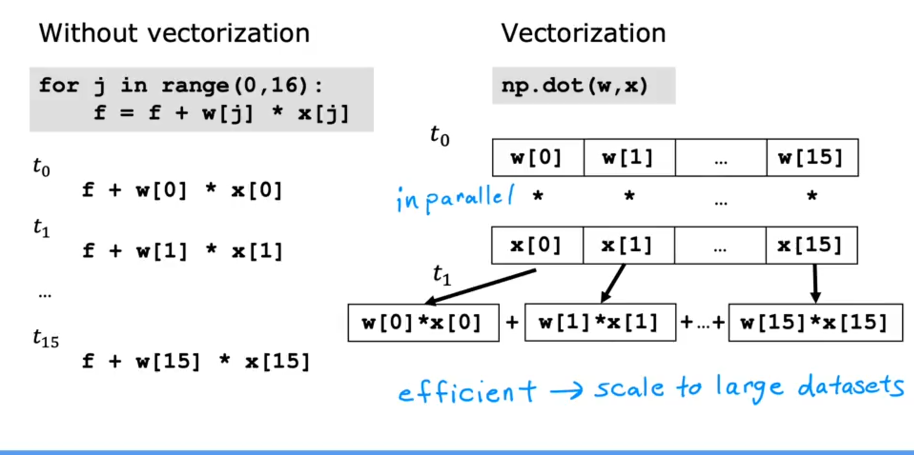
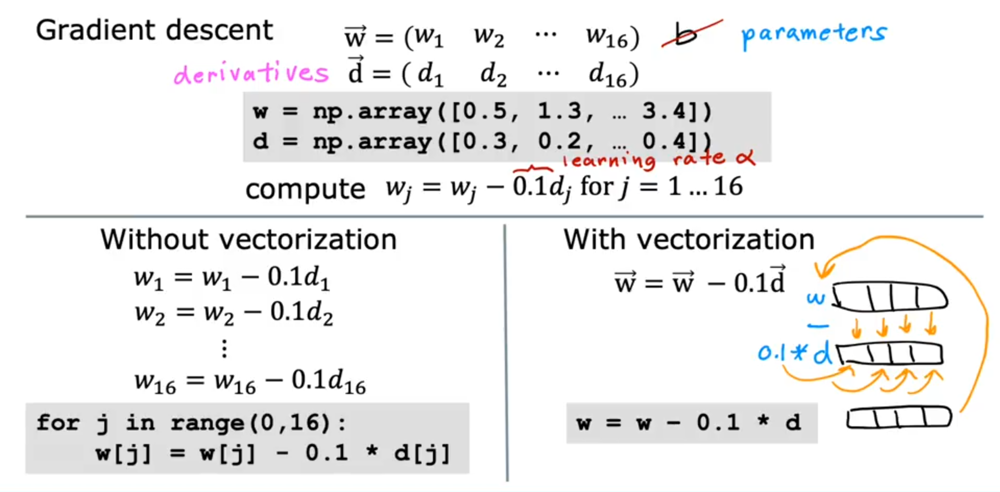

## Multiple regresion
---

# 🔍 Overview: Multiple Linear Regression

- In the earlier version of linear regression, we used only **one feature** (e.g., size of the house) to predict the output (e.g., price of the house). but for **Multiple Linear Regression** we use multiple feature for predict value such as:
  - Size of the house (`x₁`)
  - Number of bedrooms (`x₂`)
  - Number of floors (`x₃`)
  - Age of the house (`x₄`)



# 📚 Notation

- Let `xⱼ` be the **j-th feature** (e.g., `x₁`, `x₂`, ..., `xₙ`)
- Let `x⁽ⁱ⁾` be the **i-th training example** (a vector of features)
- Let `x⁽ⁱ⁾ⱼ` be the **j-th feature** of the i-th training example
- `n` is the **number of features**
- `w = [w₁, w₂, ..., wₙ]` is the **weight vector** (parameters)
- `b` is the **bias** (intercept term)
- `x = [x₁, x₂, ..., xₙ]` is the **input feature vector**

---

# 🧠 Model Definition

- **Old model (1 feature)**:
  \[
  f_{w,b}(x) = wx + b
  \]

- **New model (n features)**:
  \[
  f_{w,b}(x) = w₁x₁ + w₂x₂ + \dots + wₙxₙ + b
  \]

- **Compact vector notation using dot product**:
  \[
  f_{w,b}(x) = \vec{w} \cdot \vec{x} + b
  \]


> Dot Product
>\[
>\vec{w} \cdot \vec{x} = \sum_{j=1}^{n} w_j x_j
>\]


# 🏠 Example Interpretation (House Prices)

\[
f(x) = 0.1x₁ + 4x₂ + 10x₃ - 2x₄ + 80
\]

- `0.1`: price increases by $100 per square foot
- `4`: price increases by $4,000 per bedroom
- `10`: price increases by $10,000 per floor
- `-2`: price **decreases** by $2,000 per year of age
- `80`: base price in $1,000s (i.e., $80,000)


# ⚡ Vectorization 

- **Vectorization** is a technique to make code:
  - **Shorter** (easier to read/write)
  - **Faster** (more computationally efficient)
- Uses **linear algebra operations** and libraries like **NumPy**
- Can take advantage of **parallel hardware** like **CPUs** and **GPUs**

---

## 🧠 Example Setup

- Suppose we have:
  - `w = [w₁, w₂, w₃]` (weights)
  - `x = [x₁, x₂, x₃]` (features)
  - `b` (bias term)
- We want to compute:
  
  \[
  f(w, b, x) = w_1x_1 + w_2x_2 + w_3x_3 + b
  \]

---

## ❌ Non-Vectorized Implementation

### 1. Manual Multiplication (Not Scalable)
```python
f = w[0]*x[0] + w[1]*x[1] + w[2]*x[2] + b
```


### 2. Using a For Loop
```python
f = 0
for j in range(n):  # j = 0 to n-1
    f += w[j] * x[j]
f += b

```
- Better than manual multiplication
- Still not vectorized and slower for large n



# 🧾 Terminology

- **Multiple Linear Regression**: Linear regression with **multiple input features**
- **Univariate Regression**: Linear regression with a **single feature**
- Note: **"Multivariate regression"** refers to a different concept (not used here)


## Gradient descent for multiple linear regression
