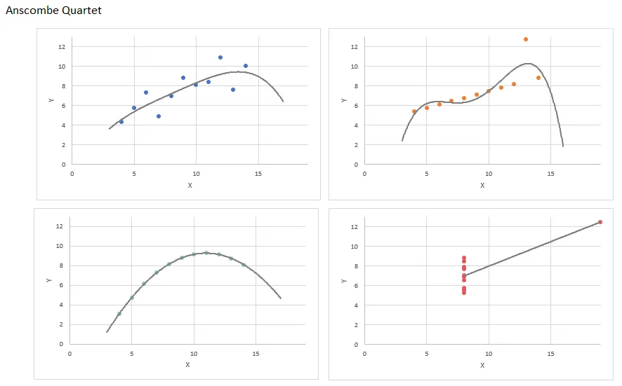

# 📈 Polynomial Regression

---

## 🔹 From Linear to Polynomial Regression

- Linear regression fits **straight lines**, but real-world data often needs **curved models**.
- **Polynomial regression** fits curves by adding powers (or roots) of the input feature `x`.

### ✏️ Examples of Polynomial Models

#### Quadratic Function
```math
f(x) = w_1 x + w_2 x^2 + b
```

#### Cubic Function
```math
f(x) = w₁x + w₂x² + w₃x³ + b
```

#### Square Root Function
```math
f(x) = w₁x + w₂√x + b
```


---
